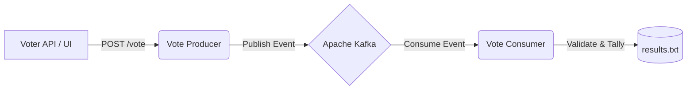

Distributed Real-Time Voting System Using Apache Kafka

A distributed, real-time electronic voting platform built using Spring Boot and Apache Kafka. This project demonstrates
distributed microservices, event-driven architecture, and real-time data processing.

1.Overview
This project simulates a highly scalable election voting system. It ensures robustness, fault tolerance, and strict "one-person-one-vote" data integrity through an Aadhar ID verification mechanism. 

The system uses a **Producer-Consumer Microservice Pattern**:
- **Vote Producer:** A lightweight Spring Boot application that provides a UI and REST API to receive votes.
- **Vote Consumer:** A Spring Boot service that continuously reads votes from Kafka, checks for duplicate Aadhar IDs, counts the valid votes, and saves the live results.
- **Apache Kafka:** Acts as the central event-streaming backbone that connects the Producer and Consumer asynchronously.
2. Key Features
- **Real-Time Data Processing:** Votes are processed and tallied immediately as they are cast.
- **Duplicate Vote Prevention:** Rejects multiple votes mapped to the same Aadhar ID to ensure true election integrity.
- **Fault-Tolerant Data Storage:** Vote tallies are continuously backed up to a local file (`results.txt`), allowing seamless recovery in case of a crash or server restart.
- **High Scalability:** Successfully load-tested with over 1,000 concurrent vote requests without data loss.

3. Technologies Used
- **Backend:** Java 17, Spring Boot 3.x
- **Event Streaming:** Apache Kafka 7.6.1, Zookeeper
- **Infrastructure:** Docker, Docker Compose
- **Scripting & Load Testing:** PowerShell

4.How to Run the Project

### 1. Start the Kafka Infrastructure
Make sure Docker Desktop is running on your machine. Launch the Kafka cluster using Docker Compose:
```bash
docker-compose up -d
```

### 2. Configuration (For Multi-Machine Setup)
If you are running the microservices across multiple physical computers, ensure you update the IP addresses in:
- `docker-compose.yml`
- `vote-consumer/src/main/resources/application.properties`
- `vote-producer/src/main/resources/application.properties`

### 3. Start the Vote Consumer
Navigate to the `vote-consumer` directory and run the application:
```bash
cd vote-consumer
./mvnw spring-boot:run
```

### 4. Start the Vote Producer
Navigate to the `vote-producer` directory and run the application:
```bash
cd vote-producer
./mvnw spring-boot:run
```

### 5. Access the Application
- Open the application in your web browser (typically `http://localhost:8080`) to cast a vote.
- View real-time live results through the Consumer API (`http://localhost:8081/results`).

5. Architecture Diagram

